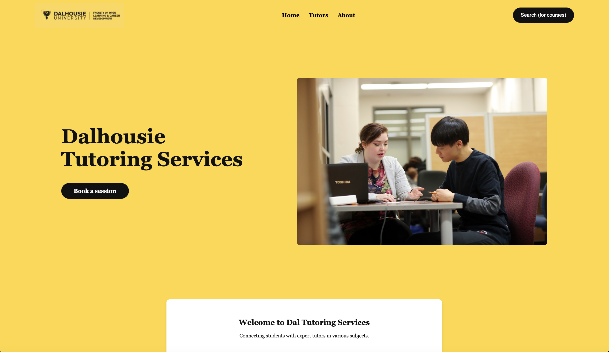
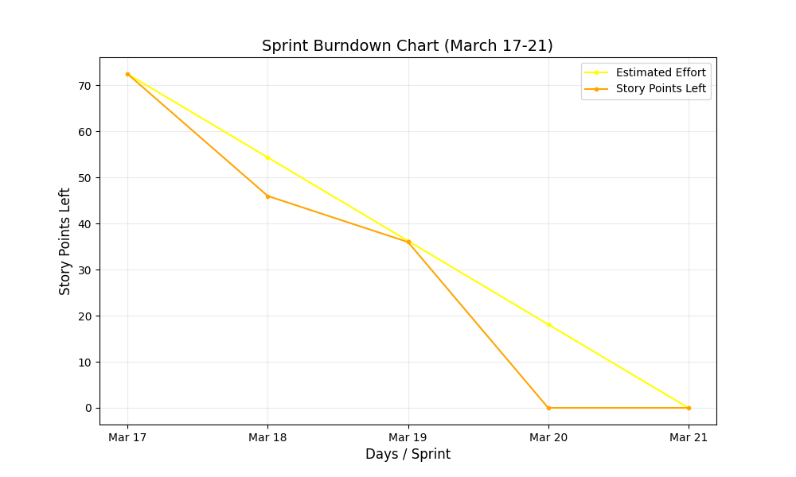

# ✨ Final Project (2690) 💫

## 📝 Description 📝
We noticed that the Dalhousie tutoring services are moderately difficult to access, which could lead to students not seeking out the support they need when it comes to learning. The current study skill section of the Dalhousie website is a link within the academic support section, which can be challenging to find on its own. Once on the study skill section, Dalhousie needs you to reach out to their 'Study/Skills and Tutoring Office' through email and phone, which could be handled much better through an interactive applications. In addition, some students might also need specialized tutoring services for certain courses that Dalhousie can't offer.

## 🌐 GitHub Link 🌐
[Link to Repository](https://github.com/NathanSully/CSCI2690FinalProject) - Shows proof that we worked on this assignment through the commit history on GitHub.

## 🏗️ Our Layout 🏗️
1. Header
    - Logo of university in the top right?
    - And profile in the top right?
2. Homepage 
    - Dalhousie Tutoring Home Page (Bright Yellow Page)
    - Academic Support Page
    - Academic Resources
3. Search Page
    - Course Search Page 
4. Tutor page
    - List of Tutors
    - Tutor Avalability
5. Course Detail Page
    - Breakdown of the Availble Tutors for the Course, and Helpful Resources 
6. Footer
    -  Has a Contact us with Mailing Address, Email, and Phone Number 

## 🔧 Tools Required for the Project 🔧
- [Latest Version of Node.js](https://nodejs.org/en)

## 💻 How to Deploy the Project (Windows) 💻
1. Open the project folder in a terminal.
    * Open a terminal/cmd prompt
    * cd (path to project folder here)
2. Launch the project using node in the terminal.
    * Type 'npm start' within the project folder to start the project
    * If you cannot use node in the terminal for some reason, please locate server.js and run that within a terminal
3. Go to your web browser and go to the site 'localhost:8000' to see the website.

## 📉 Burndown Chart 📉

## 🗺️ Roadmap 🗺️
### Research
1. Research an online website builder (we ended up coding it from scratch).
2. Find different advertisements around campus that display tutoring services (we used fake names and details for examples).
3. Conduct user research to understand the needs of target users.
4. Propose the project idea to the Tutoring Project Lead.
### Plan
5. Initial UI Design.
6. Evaluate features, scailability and integration options.
7. Determine software/languages required.
8. Map the development process.
9. Obtain approval from stakeholders.
### Testing & Developing
10. Design/Development of the backend.
11. Develop the front end.
12. Implement the website's colour scheme, typography, and visual style.
13. Test reports for accuracy and relevance.
14. Maintenance & Touchups.

## ✍️ Authors and Acknowledgment ✍️
- Nathan Sullivan (B00955241)
- Kyle Shepard (B00962444)
- Manika Gupta (B00949856)
- Laura Earl (B00919678)
- Tung Ngo (B00949590)
- Mengcheng Li (B00983864)

## ⏳ Project Status Throughout the Sprint ⏳
March 17 -  
March 18 -  
March 19 -  
March 20 -  
March 21 - 

## 📚 Resources Used 📚
    [1]     “Services,” Dalhousie University, 2025. https://www.dal.ca/about/leadership-governance/academic-integrity/faculty-resources/services.html (accessed Mar. 20, 2025).
‌